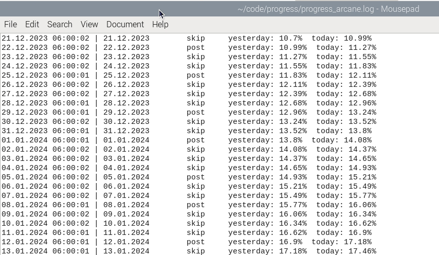
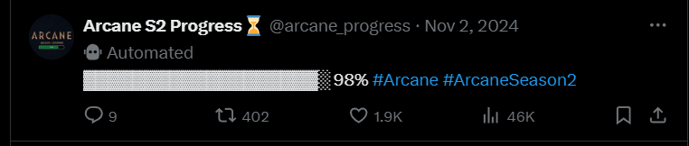

# progressbar-twitterbot

## Pre requisites

1. Install tweepy
2. Make sure to fill in the following secrets
~~~ 
access_token = ""
access_token_secret = ""
bearer_token = ""
api = ""
api_secret = ""
~~~ 
3. Use a scheduling service (I used Cron) to run the script

## How the script works

Now everytime the percentage changes the script should be creating a post. You can use the created .log file to check if something seems to not work.

The code will compare the percentage of yesterday and today. If it detects that the percentage has changed (e.g.: yesterday: 10.xx%, today: 11.xx%) it will post otherwise it won't.

A post uses ASCII elements of the bot to visualize the progress and add the percentage at the end.

